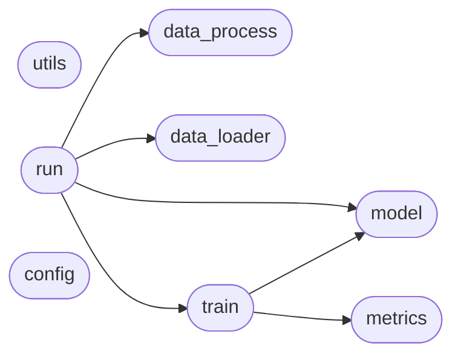

# Code Overview

[_Documentation generated by Documatic_](https://www.documatic.com)

<!---Documatic-section-Codebase Structure Python-start--->
## Codebase Structure Python

The codebase has a flat structure, with 8 code files.

<!---Documatic-block-system_architecture-start--->

<!---Documatic-block-system_architecture-end--->

# #
<!---Documatic-section-Codebase Structure Python-end--->

<!---Documatic-section-Important Functions-start--->
## Important Functions

<!---Documatic-block-important_funcs-start--->
<!---Documatic-block-most_used_funcs-start--->
### Most Utilised Functions

* BERT-Softmax.train.train (1 times)
* BERT-Softmax.train.evaluate (1 times)
* BERT-Softmax.metrics.f1_score (1 times)
* BERT-Softmax.metrics.bad_case (1 times)
<!---Documatic-block-most_used_funcs-end--->
<!---Documatic-block-important_funcs-end--->

# #
<!---Documatic-section-Important Functions-end--->

<!---Documatic-section-File IO-start--->
## File IO

<!---Documatic-block-file_io-start--->
The following files have file read operations

<!---Documatic-block-BERT_Softmax-start--->

	
<code>BERT_Softmax</code> (Click to Expand!)

* BERT-Softmax.data_process

<!---Documatic-block-BERT_Softmax-end--->

The following files have file write operations

<!---Documatic-block-BERT_Softmax-start--->

	
<code>BERT_Softmax</code> (Click to Expand!)

* BERT-Softmax.metrics

<!---Documatic-block-BERT_Softmax-end--->
<!---Documatic-block-file_io-end--->

# #
<!---Documatic-section-File IO-end--->

<!---Documatic-section-Class Hierarchy-start--->
## Class Hierarchy

<!---Documatic-block-BERT_Softmax.data_loader.NERDataset-start--->

	
<code>BERT_Softmax.data_loader.NERDataset</code> (Click to Expand!)

* BERT-Softmax.data_loader.NERDataset

<!---Documatic-block-BERT_Softmax.data_loader.NERDataset-end--->

<!---Documatic-block-BertPreTrainedModel-start--->

	
<code>BertPreTrainedModel</code> (Click to Expand!)

* BERT-Softmax.model.BertNER

<!---Documatic-block-BertPreTrainedModel-end--->

# #
<!---Documatic-section-Class Hierarchy-end--->

[_Documentation generated by Documatic_](https://www.documatic.com)