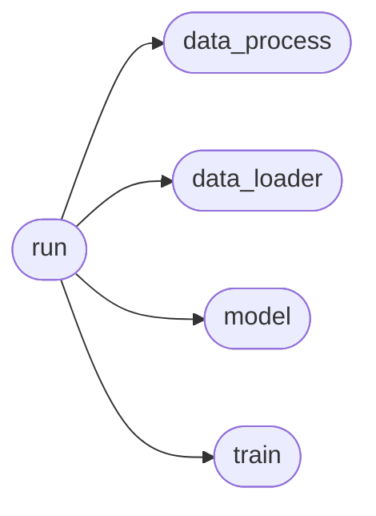
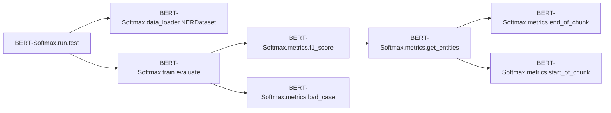
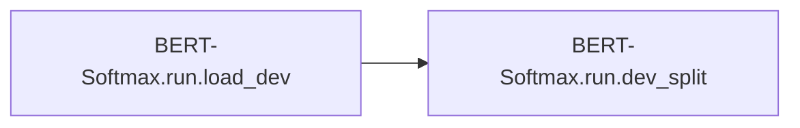
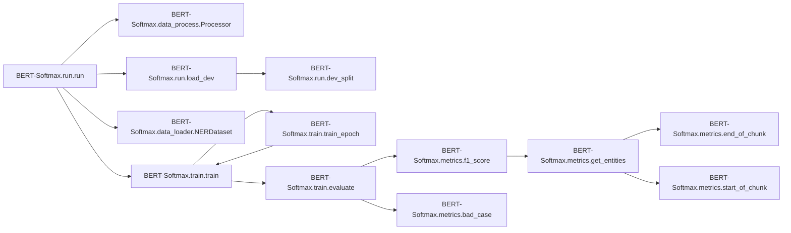

# Bert-softmax Run

[_Documentation generated by Documatic_](https://www.documatic.com)

<!---Documatic-section-Codebase Structure-start--->
## Codebase Structure

<!---Documatic-block-system_architecture-start--->

<!---Documatic-block-system_architecture-end--->

# #
<!---Documatic-section-Codebase Structure-end--->

<!---Documatic-section-BERT_Softmax.run.dev_split-start--->
## BERT-Softmax.run.dev_split

<!---Documatic-section-dev_split-start--->
<!---Documatic-block-BERT_Softmax.run.dev_split-start--->
<details>
	<summary><code>BERT_Softmax.run.dev_split</code> code snippet</summary>

```python
def dev_split(dataset_dir):
    data = np.load(dataset_dir, allow_pickle=True)
    words = data['words']
    labels = data['labels']
    (x_train, x_dev, y_train, y_dev) = train_test_split(words, labels, test_size=config.dev_split_size, random_state=0)
    return (x_train, x_dev, y_train, y_dev)
```
</details>
<!---Documatic-block-BERT_Softmax.run.dev_split-end--->
<!---Documatic-section-dev_split-end--->

# #
<!---Documatic-section-BERT_Softmax.run.dev_split-end--->

<!---Documatic-section-BERT_Softmax.run.test-start--->
## BERT-Softmax.run.test

<!---Documatic-section-test-start--->


### Object Calls

* BERT-Softmax.data_loader.NERDataset
* BERT-Softmax.train.evaluate

<!---Documatic-block-BERT_Softmax.run.test-start--->
<details>
	<summary><code>BERT_Softmax.run.test</code> code snippet</summary>

```python
def test():
    data = np.load(config.test_dir, allow_pickle=True)
    word_test = data['words']
    label_test = data['labels']
    test_dataset = NERDataset(word_test, label_test, config)
    logging.info('--------Dataset Build!--------')
    test_loader = DataLoader(test_dataset, batch_size=config.batch_size, shuffle=False, collate_fn=test_dataset.collate_fn)
    logging.info('--------Get Data-loader!--------')
    if config.model_dir is not None:
        model = BertNER.from_pretrained(config.model_dir)
        model.to(config.device)
        logging.info('--------Load model from {}--------'.format(config.model_dir))
    else:
        logging.info('--------No model to test !--------')
        return
    val_metrics = evaluate(test_loader, model, mode='test')
    val_f1 = val_metrics['f1']
    logging.info('test loss: {}, f1 score: {}'.format(val_metrics['loss'], val_f1))
    val_f1_labels = val_metrics['f1_labels']
    for label in config.labels:
        logging.info('f1 score of {}: {}'.format(label, val_f1_labels[label]))
```
</details>
<!---Documatic-block-BERT_Softmax.run.test-end--->
<!---Documatic-section-test-end--->

# #
<!---Documatic-section-BERT_Softmax.run.test-end--->

<!---Documatic-section-BERT_Softmax.run.load_dev-start--->
## BERT-Softmax.run.load_dev

<!---Documatic-section-load_dev-start--->


### Object Calls

* BERT-Softmax.run.dev_split

<!---Documatic-block-BERT_Softmax.run.load_dev-start--->
<details>
	<summary><code>BERT_Softmax.run.load_dev</code> code snippet</summary>

```python
def load_dev(mode):
    if mode == 'train':
        (word_train, word_dev, label_train, label_dev) = dev_split(config.train_dir)
    elif mode == 'test':
        train_data = np.load(config.train_dir, allow_pickle=True)
        dev_data = np.load(config.test_dir, allow_pickle=True)
        word_train = train_data['words']
        label_train = train_data['labels']
        word_dev = dev_data['words']
        label_dev = dev_data['labels']
    else:
        word_train = None
        label_train = None
        word_dev = None
        label_dev = None
    return (word_train, word_dev, label_train, label_dev)
```
</details>
<!---Documatic-block-BERT_Softmax.run.load_dev-end--->
<!---Documatic-section-load_dev-end--->

# #
<!---Documatic-section-BERT_Softmax.run.load_dev-end--->

<!---Documatic-section-BERT_Softmax.run.run-start--->
## BERT-Softmax.run.run

<!---Documatic-section-run-start--->


### Object Calls

* BERT-Softmax.data_process.Processor
* BERT-Softmax.run.load_dev
* BERT-Softmax.data_loader.NERDataset
* BERT-Softmax.train.train

<!---Documatic-block-BERT_Softmax.run.run-start--->
<details>
	<summary><code>BERT_Softmax.run.run</code> code snippet</summary>

```python
def run():
    utils.set_logger(config.log_dir)
    logging.info('device: {}'.format(config.device))
    processor = Processor(config)
    processor.process()
    logging.info('--------Process Done!--------')
    (word_train, word_dev, label_train, label_dev) = load_dev('train')
    train_dataset = NERDataset(word_train, label_train, config)
    dev_dataset = NERDataset(word_dev, label_dev, config)
    logging.info('--------Dataset Build!--------')
    train_size = len(train_dataset)
    train_loader = DataLoader(train_dataset, batch_size=config.batch_size, shuffle=True, collate_fn=train_dataset.collate_fn)
    dev_loader = DataLoader(dev_dataset, batch_size=config.batch_size, shuffle=True, collate_fn=dev_dataset.collate_fn)
    logging.info('--------Get Dataloader!--------')
    device = config.device
    model = BertNER.from_pretrained(config.roberta_model, num_labels=len(config.label2id))
    model.to(device)
    if config.full_fine_tuning:
        bert_optimizer = list(model.bert.named_parameters())
        classifier_optimizer = list(model.classifier.named_parameters())
        no_decay = ['bias', 'LayerNorm.bias', 'LayerNorm.weight']
        optimizer_grouped_parameters = [{'params': [p for (n, p) in bert_optimizer if not any((nd in n for nd in no_decay))], 'weight_decay': config.weight_decay}, {'params': [p for (n, p) in bert_optimizer if any((nd in n for nd in no_decay))], 'weight_decay': 0.0}, {'params': [p for (n, p) in classifier_optimizer if not any((nd in n for nd in no_decay))], 'lr': config.learning_rate * 5, 'weight_decay': config.weight_decay}, {'params': [p for (n, p) in classifier_optimizer if any((nd in n for nd in no_decay))], 'lr': config.learning_rate * 5, 'weight_decay': 0.0}]
    else:
        param_optimizer = list(model.classifier.named_parameters())
        optimizer_grouped_parameters = [{'params': [p for (n, p) in param_optimizer]}]
    optimizer = AdamW(optimizer_grouped_parameters, lr=config.learning_rate, correct_bias=False)
    train_steps_per_epoch = train_size // config.batch_size
    scheduler = get_cosine_schedule_with_warmup(optimizer, num_warmup_steps=train_steps_per_epoch, num_training_steps=config.epoch_num * train_steps_per_epoch)
    logging.info('--------Start Training!--------')
    train(train_loader, dev_loader, model, optimizer, scheduler, config.model_dir)
```
</details>
<!---Documatic-block-BERT_Softmax.run.run-end--->
<!---Documatic-section-run-end--->

# #
<!---Documatic-section-BERT_Softmax.run.run-end--->

[_Documentation generated by Documatic_](https://www.documatic.com)