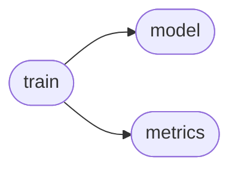
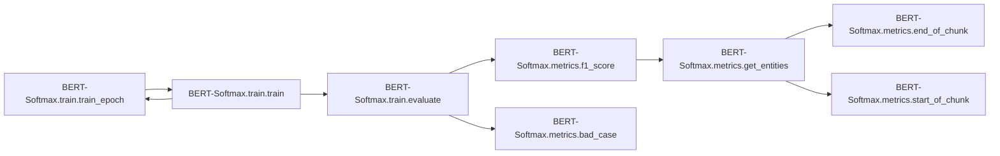
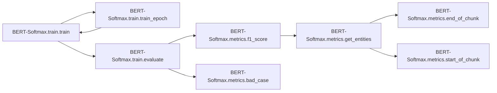
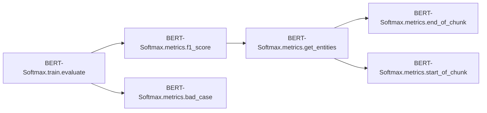

# Bert-softmax Train

[_Documentation generated by Documatic_](https://www.documatic.com)

<!---Documatic-section-Codebase Structure-start--->
## Codebase Structure

<!---Documatic-block-system_architecture-start--->

<!---Documatic-block-system_architecture-end--->

# #
<!---Documatic-section-Codebase Structure-end--->

<!---Documatic-section-BERT_Softmax.train.train_epoch-start--->
## BERT-Softmax.train.train_epoch

<!---Documatic-section-train_epoch-start--->


### Object Calls

* BERT-Softmax.train.train

<!---Documatic-block-BERT_Softmax.train.train_epoch-start--->
<details>
	<summary><code>BERT_Softmax.train.train_epoch</code> code snippet</summary>

```python
def train_epoch(train_loader, model, optimizer, scheduler, epoch):
    model.train()
    train_losses = 0
    for (idx, batch_samples) in enumerate(tqdm(train_loader)):
        (batch_data, batch_token_starts, batch_labels) = batch_samples
        batch_masks = batch_data.gt(0)
        loss = model((batch_data, batch_token_starts), token_type_ids=None, attention_mask=batch_masks, labels=batch_labels)[0]
        train_losses += loss.item()
        model.zero_grad()
        loss.backward()
        nn.utils.clip_grad_norm_(parameters=model.parameters(), max_norm=config.clip_grad)
        optimizer.step()
        scheduler.step()
    train_loss = float(train_losses) / len(train_loader)
    logging.info('Epoch: {}, train loss: {}'.format(epoch, train_loss))
```
</details>
<!---Documatic-block-BERT_Softmax.train.train_epoch-end--->
<!---Documatic-section-train_epoch-end--->

# #
<!---Documatic-section-BERT_Softmax.train.train_epoch-end--->

<!---Documatic-section-BERT_Softmax.train.train-start--->
## BERT-Softmax.train.train

<!---Documatic-section-train-start--->


### Object Calls

* BERT-Softmax.train.train_epoch
* BERT-Softmax.train.evaluate

<!---Documatic-block-BERT_Softmax.train.train-start--->
<details>
	<summary><code>BERT_Softmax.train.train</code> code snippet</summary>

```python
def train(train_loader, dev_loader, model, optimizer, scheduler, model_dir):
    if model_dir is not None and config.load_before:
        model = BertNER.from_pretrained(model_dir)
        model.to(config.device)
        logging.info('--------Load model from {}--------'.format(model_dir))
    best_val_f1 = 0.0
    patience_counter = 0
    for epoch in range(1, config.epoch_num + 1):
        train_epoch(train_loader, model, optimizer, scheduler, epoch)
        val_metrics = evaluate(dev_loader, model)
        val_f1 = val_metrics['f1']
        logging.info('Epoch: {}, dev loss: {}, f1 score: {}'.format(epoch, val_metrics['loss'], val_f1))
        improve_f1 = val_f1 - best_val_f1
        if improve_f1 > 1e-05:
            best_val_f1 = val_f1
            model.save_pretrained(model_dir)
            logging.info('--------Save best model!--------')
            if improve_f1 < config.patience:
                patience_counter += 1
            else:
                patience_counter = 0
        else:
            patience_counter += 1
        if patience_counter >= config.patience_num and epoch > config.min_epoch_num or epoch == config.epoch_num:
            logging.info('Best val f1: {}'.format(best_val_f1))
            break
    logging.info('Training Finished!')
```
</details>
<!---Documatic-block-BERT_Softmax.train.train-end--->
<!---Documatic-section-train-end--->

# #
<!---Documatic-section-BERT_Softmax.train.train-end--->

<!---Documatic-section-BERT_Softmax.train.evaluate-start--->
## BERT-Softmax.train.evaluate

<!---Documatic-section-evaluate-start--->


### Object Calls

* BERT-Softmax.metrics.f1_score
* BERT-Softmax.metrics.bad_case

<!---Documatic-block-BERT_Softmax.train.evaluate-start--->
<details>
	<summary><code>BERT_Softmax.train.evaluate</code> code snippet</summary>

```python
def evaluate(dev_loader, model, mode='dev'):
    model.eval()
    tokenizer = BertTokenizer.from_pretrained(config.bert_model, do_lower_case=True, skip_special_tokens=True)
    id2label = config.id2label
    true_tags = []
    pred_tags = []
    sent_data = []
    dev_losses = 0
    with torch.no_grad():
        for (idx, batch_samples) in enumerate(dev_loader):
            (batch_data, batch_token_starts, batch_tags) = batch_samples
            sent_data.extend([[tokenizer.convert_ids_to_tokens(idx.item()) for idx in indices if idx.item() > 0 and idx.item() != 101] for indices in batch_data])
            batch_masks = batch_data.gt(0)
            loss = model((batch_data, batch_token_starts), token_type_ids=None, attention_mask=batch_masks, labels=batch_tags)[0]
            dev_losses += loss.item()
            batch_output = model((batch_data, batch_token_starts), token_type_ids=None, attention_mask=batch_masks)[0]
            batch_output = batch_output.detach().cpu().numpy()
            batch_tags = batch_tags.to('cpu').numpy()
            pred_tags.extend([[id2label.get(idx) for idx in indices] for indices in np.argmax(batch_output, axis=2)])
            true_tags.extend([[id2label.get(idx) if idx != -1 else 'O' for idx in indices] for indices in batch_tags])
    assert len(pred_tags) == len(true_tags)
    assert len(sent_data) == len(true_tags)
    metrics = {}
    if mode == 'dev':
        f1 = f1_score(true_tags, pred_tags, mode)
        metrics['f1'] = f1
    else:
        bad_case(true_tags, pred_tags, sent_data)
        (f1_labels, f1) = f1_score(true_tags, pred_tags, mode)
        metrics['f1_labels'] = f1_labels
        metrics['f1'] = f1
    metrics['loss'] = float(dev_losses) / len(dev_loader)
    return metrics
```
</details>
<!---Documatic-block-BERT_Softmax.train.evaluate-end--->
<!---Documatic-section-evaluate-end--->

# #
<!---Documatic-section-BERT_Softmax.train.evaluate-end--->

[_Documentation generated by Documatic_](https://www.documatic.com)